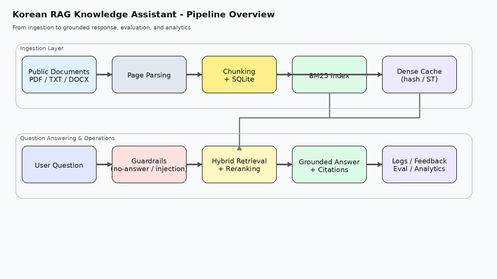

# 공공 문서 기반 한국어 RAG

공공기관 안내문이나 공지 문서를 모아서, 질문하면 관련 문단과 출처를 같이 보여주는 RAG 프로젝트입니다.

처음에는 생성형 답변을 크게 넣기보다, **문서를 잘 적재하고 잘 찾고, 근거가 약하면 답을 보류하는 것**에 집중했습니다. 포트폴리오에서도 이 부분이 더 중요하다고 판단해서 현재 버전은 추출형 답변과 citation 중심으로 정리했습니다.



## 프로젝트 개요
이 프로젝트가 하는 일은 단순합니다.

1. 문서를 올리거나 공개 웹페이지를 가져옵니다.
2. 문서를 청크로 나눠 저장하고 인덱스를 만듭니다.
3. 질문이 들어오면 관련 청크를 찾습니다.
4. 근거가 충분하면 답변과 출처를 같이 반환합니다.
5. 문서 밖 질문이나 근거가 약한 질문은 `no_answer` 또는 `guard_blocked`로 처리합니다.

실제로는 이 흐름을 안정적으로 굴리는 데 시간이 많이 들어가서, README도 그 기준으로 적었습니다.

## 현재 구현한 범위
- PDF / TXT / DOCX 업로드
- 공개 URL을 TXT 스냅샷으로 저장해서 corpus에 편입
- 청크 분할 및 SQLite 저장
- BM25 + dense retrieval 기반 하이브리드 검색
- 간단한 heuristic reranking
- citation 포함 답변 반환
- 문서 밖 질문, 프롬프트 인젝션 차단
- 평가셋 실행 및 HTML 리포트 생성
- FastAPI API + Streamlit 데모 화면
- query log / feedback / analytics 조회
- smoke test / unittest / GitHub Actions

## 일부러 이렇게 설계한 이유
### 1) 생성형보다 근거 우선
초기 아이디어는 생성형 답변이었지만, 제출용 프로젝트에서는 “왜 이 답이 나왔는지”를 바로 보여주는 쪽이 더 낫다고 봤습니다. 그래서 현재는 **추출형 grounded answer**를 기본값으로 두고, 근거가 약하면 답변을 억지로 만들지 않도록 했습니다.

### 2) 웹페이지는 스냅샷으로 정규화
공공기관 공지는 PDF보다 HTML로 올라오는 경우가 꽤 많아서 URL 적재를 넣었습니다. 다만 실시간 크롤러처럼 처리하기보다는, **텍스트 스냅샷을 남기는 방식**으로 단순화했습니다. 이렇게 하면 재현이 쉽고 디버깅도 편합니다.

### 3) 범위는 넓히기보다 끝까지 돌아가게
HWP, OCR, cross-encoder reranker, 생성형 응답까지 한 번에 넣을 수도 있었지만, 현재 저장소는 **PDF/TXT/DOCX + 웹 공지 + 평가 + 데모**까지를 안정적으로 묶는 쪽으로 범위를 잡았습니다.

## 실행 방법
### 1. 환경 준비
```bash
python -m venv .venv
source .venv/bin/activate      # Windows: .venv\Scripts\activate
pip install -r requirements.txt
cp .env.example .env
```

### 2. 샘플 데이터로 바로 실행
```bash
make reset
make seed
make ingest
make run
```

실행 후 확인할 수 있는 주소
- API 문서: `http://127.0.0.1:8000/docs`
- 헬스체크: `GET /health`
- 인덱스 상태: `GET /system/index`
- 운영 요약: `GET /analytics/summary`

### 3. Streamlit 데모
```bash
pip install -r requirements-optional.txt
make demo
```
- 데모 UI: `http://127.0.0.1:8501`

## 문서 적재
### 로컬 문서 적재
```bash
make ingest
```

기본적으로 `storage/raw` 아래 문서를 읽어 인덱스를 만듭니다.

### 공개 웹페이지 단건 적재
```bash
curl -X POST "http://127.0.0.1:8000/documents/ingest-url" \
  -H "Content-Type: application/json" \
  -d '{
    "url": "https://www.gov.kr/portal/locgovNews/4679243?hideurl=N",
    "title_hint": "희망디딤돌 인천센터 자립생활실 입주자 상시모집 안내",
    "filename_hint": "hope_stepping_stone_incheon_housing"
  }'
```

### URL 매니페스트 일괄 적재
```bash
make ingest-public
```
또는
```bash
python scripts/ingest_url_manifest.py --manifest data/corpus/public_service_manifest.csv
```

적재 결과는 아래 위치에 쌓입니다.
- 원문/스냅샷: `storage/raw/`
- 웹페이지 스냅샷: `storage/raw/web_imports/`
- 검색 인덱스/DB: `storage/`

## 평가
```bash
make eval-portfolio
```
또는
```bash
python scripts/run_local_eval.py --eval-file data/eval/portfolio_eval.jsonl
```

평가 결과는 JSON과 HTML 두 형식으로 저장됩니다.
- `storage/evals/*.json`
- `storage/evals/*.html`
- 예시 리포트: [`docs/sample_eval_report.html`](docs/sample_eval_report.html)

제가 실제로 발표용으로 가장 많이 쓴 건 HTML 리포트였습니다. 캡처해 넣기 편하고, 실패 사례 정리도 수월했습니다.

## 자주 보는 API
- `POST /chat`
- `POST /documents/upload`
- `POST /documents/ingest-url`
- `GET /documents`
- `GET /system/index`
- `GET /analytics/summary`
- `GET /analytics/recent-queries`
- `GET /analytics/document-usage`
- `POST /evals/run`
- `POST /feedback`

## 폴더 구조
```text
rag_knowledge_assistant_starter/
├─ app/
│  ├─ api/
│  ├─ core/
│  ├─ db/
│  ├─ models/
│  └─ services/
├─ data/
│  ├─ corpus/
│  └─ eval/
├─ docs/
├─ scripts/
├─ storage/
├─ tests/
├─ ui/
├─ Dockerfile
├─ docker-compose.yml
├─ Makefile
└─ README.md
```

## 로컬에서 확인한 것
아래 항목은 로컬 기준으로 직접 확인했습니다.

- `python -m unittest discover -s tests -v`
- `python scripts/smoke_test.py`
- `python scripts/run_local_eval.py --eval-file data/eval/portfolio_eval.jsonl`

샘플 평가셋에서는 아래 값이 나왔습니다.
- Retrieval Hit Rate: 100%
- Keyword Hit Rate: 100%
- Citation Hit Rate: 100%
- No-answer 정확도: 100%
- 평균 응답 시간: 3.47ms

다만 이 수치는 **샘플 문서 + hash backend 기준**입니다. 실제 제출에서는 문서를 바꾸고 질문셋을 늘리면 숫자가 달라질 수 있습니다. `sentence-transformers` 경로는 옵션으로 연결해 두었고, 해당 쪽은 모델 다운로드가 가능한 환경에서 다시 검증하는 편이 안전합니다.

## 아직 남겨둔 것
현재 저장소에서 의도적으로 가볍게 둔 부분도 있습니다.

- HWP 원본 직접 파싱
- OCR 기반 스캔 PDF 처리
- cross-encoder reranker
- 생성형 LLM 답변
- 대규모 corpus 기준 성능 최적화

즉, 지금 버전은 “실제로 끝까지 돌아가는 RAG 베이스라인”에 가깝습니다. 여기서 문서셋과 평가셋을 키우는 식으로 확장하면 됩니다.

## 같이 보면 좋은 문서
- GitHub 업로드 가이드: [`docs/github_publish_guide.md`](docs/github_publish_guide.md)
- 포트폴리오 소개글: [`docs/portfolio_intro_ko.md`](docs/portfolio_intro_ko.md)
- 이력서 bullet: [`docs/resume_bullets.md`](docs/resume_bullets.md)
- 데모 스크립트: [`docs/demo_script.md`](docs/demo_script.md)
- 면접 Q&A: [`docs/interview_qa.md`](docs/interview_qa.md)
- 제출 체크리스트: [`docs/final_submission_checklist.md`](docs/final_submission_checklist.md)
- 검증 기록: [`docs/validation_report.md`](docs/validation_report.md)

## 메모
- `data/corpus/public_service_manifest.csv`는 시작용 예시입니다. 실제 제출본에서는 본인이 직접 검토한 기관 공지로 교체하는 편이 좋습니다.
- 데모용 샘플 문서만으로는 프로젝트 완성도가 다 안 보일 수 있어서, 최종 제출 전에는 문서 20~50개 정도를 넣고 다시 평가하는 것을 권장합니다.
