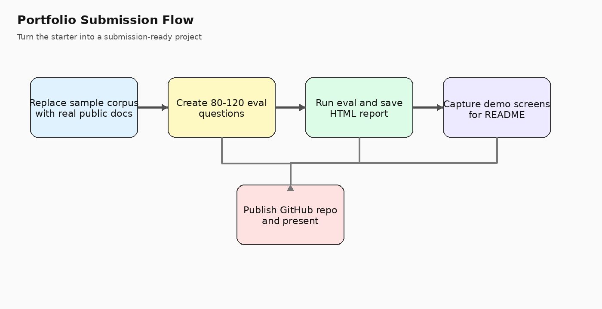

# 공개 웹문서 코퍼스 반영 가이드

이 프로젝트는 로컬 파일 업로드뿐 아니라 **공개 URL을 TXT 스냅샷으로 저장한 뒤 바로 적재**할 수 있습니다.

## 기본 흐름
1. `data/corpus/public_service_manifest.csv`에 URL을 정리합니다.
2. `python scripts/ingest_url_manifest.py --manifest data/corpus/public_service_manifest.csv`
3. `storage/raw/web_imports/*.txt`에 스냅샷이 저장됩니다.
4. 같은 문서셋으로 평가셋을 실행해 retrieval / citation / no-answer를 점검합니다.

## 매니페스트 컬럼
- `enabled`: 적재 여부
- `slug`: 스냅샷 파일명
- `title`: 문서 제목 힌트
- `url`: 가져올 페이지 URL
- `source_kind`: service / notice / news 같은 구분
- `domain`: 출처 도메인
- `topic`: 주제 분류
- `notes`: 작업 메모

## 어떤 문서를 고르면 좋은가
- 신청기간, 지원대상, 지원금액, 신청방법, 구비서류가 드러나는 공지
- 최신 공고와 이전 연도 공고를 함께 제공하는 페이지
- PDF/HWP 첨부파일이 함께 달린 안내 페이지
- 질문으로 바꾸기 쉬운 구조화 문서

## 주의할 점
- 일부 페이지는 접속 대기/차단 문구가 포함될 수 있습니다.
- 기본 로더는 흔한 boilerplate를 제거하지만, 사이트별로 추가 정제가 필요할 수 있습니다.
- 실제 제출본에서는 예시 URL 대신 본인이 검토한 문서셋으로 교체하는 편이 안전합니다.

## 추천 작업 순서
1. 10건 이하의 작은 문서셋으로 먼저 적재
2. 스냅샷 TXT를 열어 노이즈 확인
3. 질문 20~30개로 미니 평가
4. 문서셋을 20~50건까지 확장
5. 최종 80~120개 평가셋 구성
